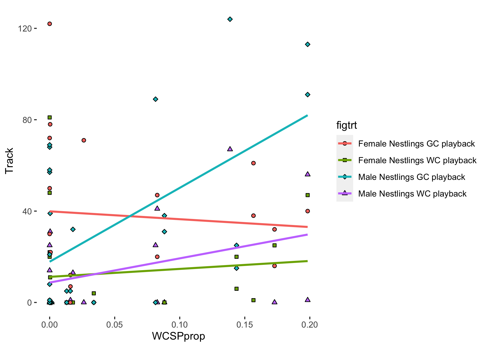

```{r setup, include=FALSE}
knitr::opts_chunk$set(echo = TRUE)
require(pacman)
p_load(dplyr,data.table,multcomp,ggplot2,ggrepel,MuMIn)
```

The analysis and figures presented in <a href="https://www.frontiersin.org/articles/10.3389/fevo.2020.00099/full">Hudson, Creanza and Shizuka 2020</a>.




```{r include=FALSE}

```

