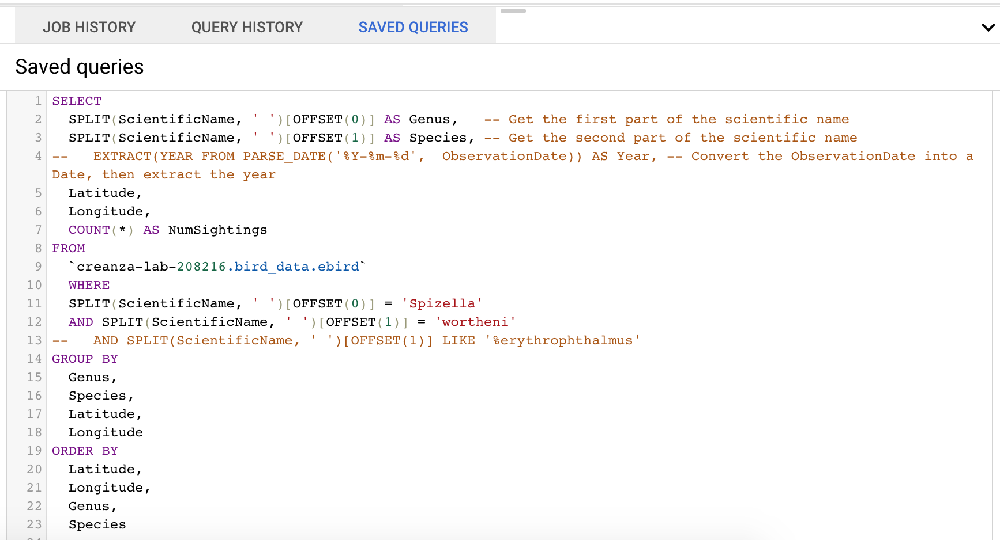
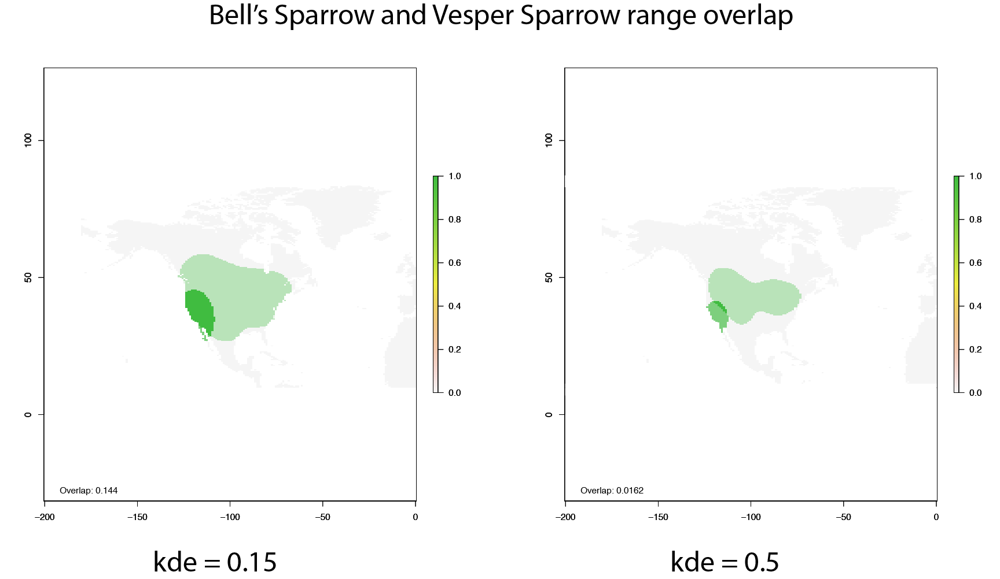
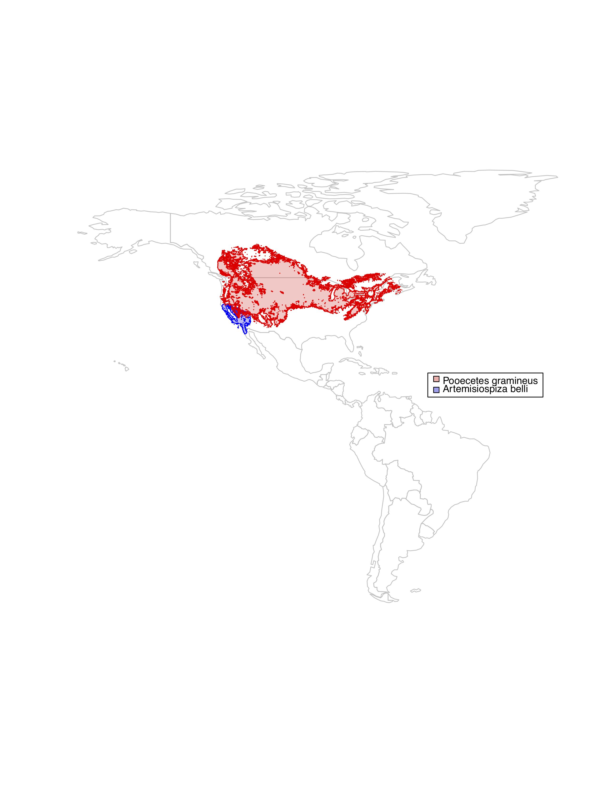

```{r setup, include=FALSE}
knitr::opts_chunk$set(echo = TRUE)
library(png,gridded)
```

## Generating kde-based range maps from observance data

As part of a project with Megan Mitchell and <a href="https://as.vanderbilt.edu/biosci/bio/nicole-creanza">Nicole Creanza</a>, I used BigQuery on the Google Cloud platform to compile sighting records of 42 species of in the Passerellidae family of sparrows. Our goal was to estimate the degree of range overlap for each pair of sister species; we wanted the range to be restricted to breeding season, where applicable, and comparable across species with orders of magnitude differences in number of recorded sightings. For most North American sparrows, thousands of records were compiled on eBird.



Below are an example of some basic range maps I generated using different density estimations from one sister species pair. 




## eBird Status and Trends

Ultimately, we decided to take advantage of the <a href="https://registry.opendata.aws/ebirdst/">eBird Status and Trends dataset</a>, which combines eBird reports with satellite images and statistical models to predict species occupancy every week of the year.




